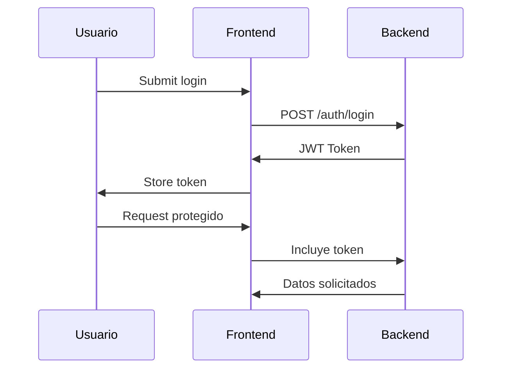

# PBooks

Una página web donde se crean libros personales, usuarios crean sus propios libros. También pueden usar CRUD para los libros creados, con usuario **admin** que puede modificar todos los libros existentes.


## Tabla de Contenidos
1. [Requisitos del Sistema](#requisitos-del-sistema)
2. [Configuración Inicial](#configuración-inicial)
3. [Estructura del Proyecto](#estructura-del-proyecto)
4. [Manual de Usuario](#manual-de-usuario)
5. [Manual del Desarrollador](#manual-del-desarrollador)
6. [API Documentation](#api-documentation)
7. [Consideraciones de Seguridad](#consideraciones-de-seguridad)
8. [Despliegue](#despliegue)
9. [Solución de Problemas](#solución-de-problemas)

---

## Requisitos del Sistema

### Backend (Node.js)
- Node.js v16+
- MySQL 8+
- npm 7+

### Frontend (PHP)
- PHP 8.0+
- Servidor web (Apache/Nginx)
- Composer (opcional)

---

## Configuración Inicial

### 1. Base de Datos
```sql
CREATE DATABASE pbook;
USE pbook;

CREATE TABLE IF NOT EXISTS `usuarios` (
  `id` int(11) NOT NULL AUTO_INCREMENT,
  `username` varchar(50) DEFAULT NULL,
  `password` varchar(255) DEFAULT NULL,
  `is_admin` tinyint(1) DEFAULT 0,
  PRIMARY KEY (`id`),
  UNIQUE KEY `username` (`username`)
) ENGINE=InnoDB AUTO_INCREMENT=0 DEFAULT CHARSET=utf8mb4 COLLATE=utf8mb4_general_ci;

CREATE TABLE IF NOT EXISTS `libros` (
  `id` int(11) NOT NULL AUTO_INCREMENT,
  `title` varchar(50) NOT NULL,
  `author` varchar(50) DEFAULT NULL,
  `description` text DEFAULT NULL,
  `year` int(11) DEFAULT NULL,
  `category` varchar(25) DEFAULT NULL,
  `img_url` varchar(255) DEFAULT 'https://edit.org/images/cat/portadas-libros-big-2019101610.jpg',
  `user_id` int(11) DEFAULT NULL,
  PRIMARY KEY (`id`),
  KEY `FK_libros_usuarios` (`user_id`),
  CONSTRAINT `FK_libros_usuarios` FOREIGN KEY (`user_id`) REFERENCES `usuarios` (`id`) ON DELETE CASCADE ON UPDATE CASCADE
) ENGINE=InnoDB AUTO_INCREMENT=0 DEFAULT CHARSET=utf8mb4 COLLATE=utf8mb4_general_ci;
```

### 2. Variables de Entorno (.env)
```ini
# Backend
DB_HOST=localhost
DB_USER=root
DB_PASSWORD=
DB_NAME=libreria
JWT_SECRET=tu_clave_secreta_jwt
PORT=3000

# Frontend
BASE_URL=/frontend/
API_BASE_URL=http://localhost:3000
```

---

## Estructura del Proyecto

```
.
├── backend/
│   ├── config/
│   ├── controllers/
│   ├── middlewares/
│   ├── models/
│   ├── routes/
│   ├── app.js
│   └── package.json
├── frontend/
│   ├── assets/
│   ├── auth/
│   ├── crud/
│   ├── includes/
│   ├── partials/
│   └── index.php
├── database/
│   └── schema.sql
└── README.md
```

---

## Manual de Usuario

### Registro
1. Navegar a `/auth/registro.php`
2. Completar formulario
3. Hacer clic en "Registrarse"

### Login
1. Navegar a `/auth/login.php`
2. Ingresar credenciales
3. Hacer clic en "Ingresar"

### Gestión de Libros
- **Agregar**: `/crud/agregar.php`
- **Editar**: `/crud/editar.php?id=X`
- **Eliminar**: `/crud/eliminar.php?id=X`

---

## Manual del Desarrollador

### Iniciar Backend
```bash
cd backend
npm install
npm start
```

### Configurar Frontend
1. Asegurar que Apache/Nginx sirva los archivos PHP
2. Verificar rutas en `includes/config.php`

### Flujo de Autenticación


---

## API Documentation

### Auth Endpoints
| Endpoint | Método | Descripción |
|----------|--------|-------------|
| `/auth/register` | POST | Registro de usuarios |
| `/auth/login` | POST | Autenticación |

### Book Endpoints
| Endpoint | Método | Auth | Descripción |
|----------|--------|------|-------------|
| `/libros` | GET | Sí | Obtener libros |
| `/libros` | POST | Sí | Crear libro |
| `/libros/:id` | PUT | Sí | Actualizar libro |

---

## Consideraciones de Seguridad

1. **JWT**:
   - Validez: 8 horas
   - Almacenamiento: HttpOnly cookies

2. **Contraseñas**:
   - Hash: bcrypt
   - Longitud mínima: 6 caracteres

3. **Protección**:
   - CSRF tokens en formularios
   - Rate limiting (100 reqs/min)

---

## Despliegue

### Producción
```bash
# Backend
NODE_ENV=production npm start

# Frontend
Configurar virtual host en Apache/Nginx
```

### Docker
```dockerfile
# Ejemplo Dockerfile para backend
FROM node:16
WORKDIR /app
COPY package*.json ./
RUN npm install
COPY . .
EXPOSE 3000
CMD ["node", "app.js"]
```

---

## Solución de Problemas

### Errores Comunes
1. **Conexión a DB fallida**:
   - Verificar credenciales en .env
   - Asegurar que MySQL esté corriendo

2. **JWT inválido**:
   - Verificar expiración
   - Confirmar secreto JWT

3. **CORS errors**:
   - Verificar cabeceras en backend
   - Configurar correctamente BASE_URL
